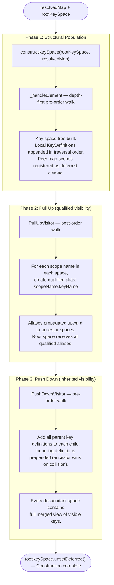

# Key Space Construction: Three-Phase Overview

## Effect of each phase

| Phase | What it builds | Who benefits |
|-------|---------------|--------------|
| 1 — Populate | Local key definitions in each scope | Same-scope resolution |
| 2 — Pull up | Scope-qualified aliases (`child.key`) in ancestor spaces | Ancestor-to-descendant qualified references |
| 3 — Push down | Inherited ancestor definitions in every descendant | Unqualified resolution of ancestor keys from any descendant context |
