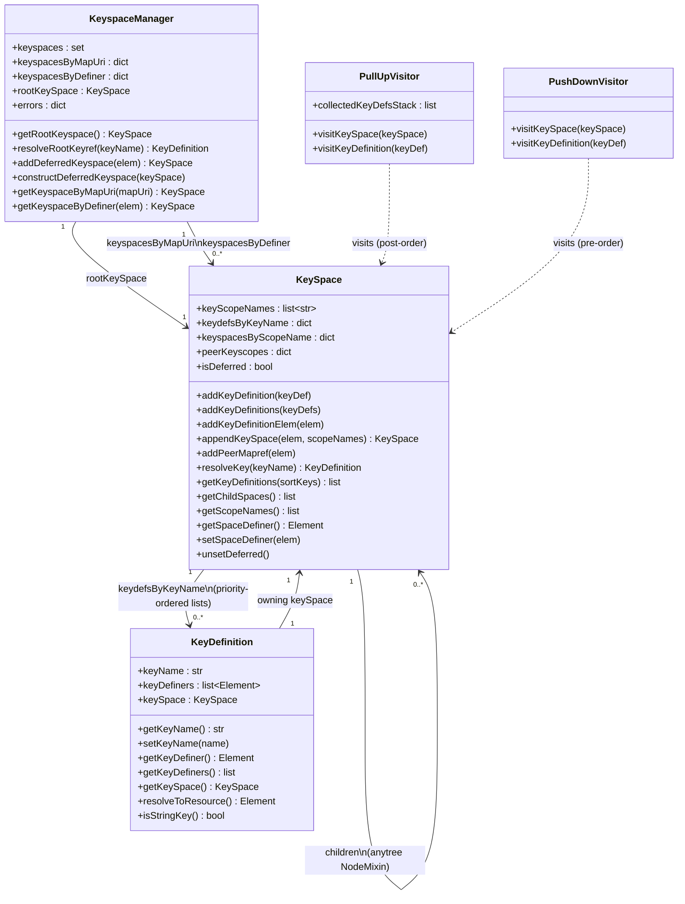
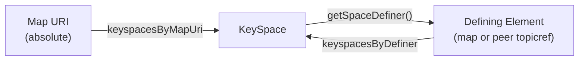
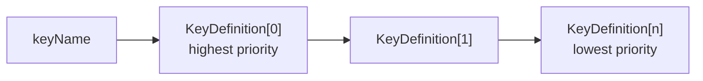

# Key Space Construction: Core Data Model

## Index relationships in `KeyspaceManager`

## Key definition priority list

Each key name maps to an **ordered list** of `KeyDefinition` objects. Index 0 is the highest-priority definition and is the one returned by `resolveKey()`.

