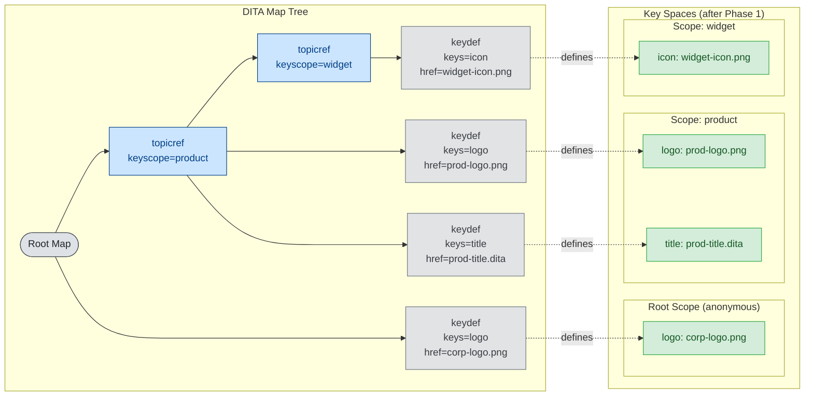

# Key Space Construction Example — Phase 1: Populate

Each scope contains only the key definitions declared directly within it.
The map tree on the right is the source; the key spaces on the left reflect what has been collected so far.

**Legend**

| Color | Meaning |
|-------|---------|
| Green | Locally defined key (declared directly in this scope) |
| Blue node | Scope-creating topicref (`keyscope` attribute) |
| Gray node | Key-defining element (`keys` attribute) |

After Phase 1, each scope sees **only its own directly declared keys**.
`product` has its own `logo` — but so does the root. That conflict is not yet resolved.
`widget`'s `icon` is invisible to `product` and root until Phase 2.
