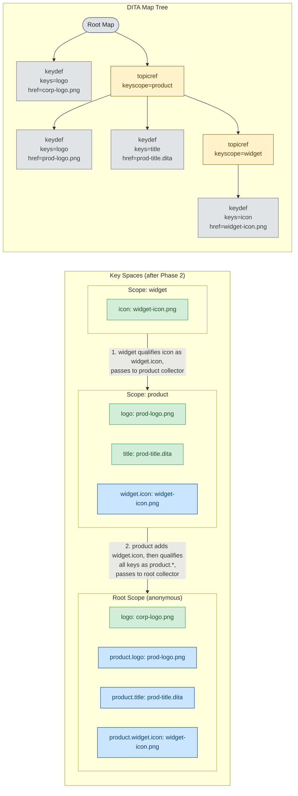

# Key Space Construction Example — Phase 2: Pull Up

`PullUpVisitor` walks post-order (leaves first). Each scope qualifies its key names with its own scope name and passes them up to its parent's collector. After a parent finishes visiting all children, it adds the collected aliases to itself, then re-qualifies the full set before passing further up.

**What changed from Phase 1**

| Scope | New entries added by pull-up |
|-------|------------------------------|
| `product` | `widget.icon: widget-icon.png` (from widget, step 1) |
| Root | `product.logo`, `product.title`, `product.widget.icon` (from product, step 2) |
| `widget` | — (leaf scope, nothing to receive) |

**Legend**

| Color | Meaning |
|-------|---------|
| Green | Locally defined key (from Phase 1) |
| Blue | Qualified alias added by pull-up (this phase) |

After Phase 2, the root can resolve `product.widget.icon` even though `icon` was declared two levels down.
The `logo` conflict is still unresolved — both root and `product` have their own local `logo` definition.
That is resolved in Phase 3.
