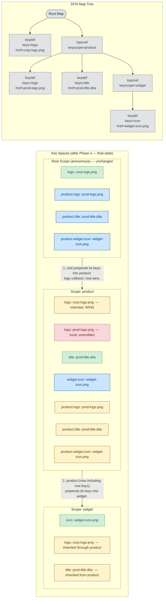

# Key Space Construction Example — Phase 3: Push Down

`PushDownVisitor` walks pre-order (root first). Each scope prepends all of its own key definitions into each direct child. Because prepending gives the incoming definitions higher priority, ancestor definitions **win** over same-name descendant definitions.

**What changed from Phase 2**

| Scope | Effect |
|-------|--------|
| Root | Unchanged |
| `product` | Received root's keys prepended. `logo` now resolves to `corp-logo.png` (root wins). Also gained `product.logo`, `product.title`, `product.widget.icon`. |
| `widget` | Received product's full key set (which already includes root's keys). `logo` and `title` are now visible unqualified. |

**Legend**

| Color | Meaning |
|-------|---------|
| Green | Locally defined (Phase 1) |
| Blue | Qualified alias from pull-up (Phase 2) |
| Yellow | Inherited via push-down (this phase) |
| Red dashed | Local definition that was overridden — still in the list at lower priority, but never returned by `resolveKey()` |

**The override in detail**

Before push-down, `product`'s `logo` list was: `[prod-logo.png]`.

After root prepends its definitions, the list becomes: `[corp-logo.png, prod-logo.png]`.

`resolveKey("logo")` returns index 0 — `corp-logo.png` — regardless of where in the `product` scope the reference appears.
