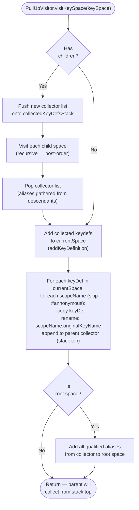
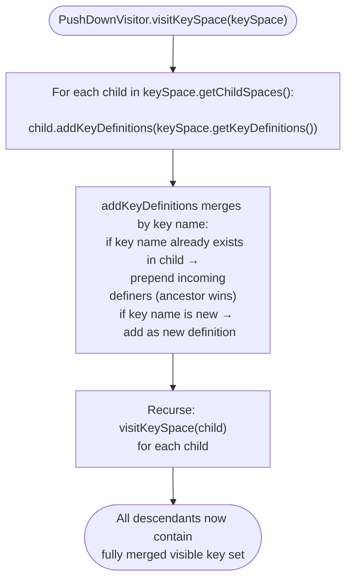

# Key Space Construction: Phase 2 Pull-Up and Phase 3 Push-Down

## Phase 2 — Pull Up (`PullUpVisitor`)

Pull-up makes descendant keys visible to ancestors via scope-qualified aliases. The visitor uses a stack of collector lists to gather aliases as it ascends the tree.

**Effect:** After pull-up, an ancestor space can resolve `subscope.key` even though `key` was defined in a descendant scope.

---

## Phase 3 — Push Down (`PushDownVisitor`)

Push-down makes ancestor keys available unqualified in every descendant scope, and enforces ancestor-wins precedence for duplicate key names.

**Effect:** After push-down, content anywhere in the map tree can resolve keys defined in any ancestor scope without qualification, and ancestor definitions take precedence over same-name descendant definitions.

---

## Combined precedence model

| Mechanism | Operation | Precedence effect |
|-----------|-----------|-------------------|
| Phase 1 append | `list.append(keyDef)` | Earlier traversal order wins |
| Phase 2 pull-up | Copy + rename to qualified alias | Ancestors gain access to descendant keys via qualified names |
| Phase 3 push-down | `list.prepend(inherited)` | Ancestor definitions override same-name descendant definitions |
